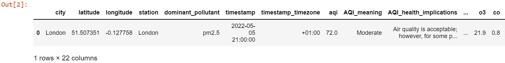

<div align=center

</br>

# Ozon3


[](https://badge.fury.io/py/ozon3) <a href="CONTRIBUTING.md#pull-requests"></a>  [](https://github.com/Ozon3Org/Ozon3/actions/workflows/pages/pages-build-deployment) [](https://github.com/Ozon3Org/Ozon3/actions/workflows/dependency-review.yml) [](https://github.com/Ozon3Org/Ozon3/actions/workflows/test.yml) [](https://codecov.io/github/Ozon3Org/Ozon3)
[](https://www.buymeacoffee.com/MilindSharma)

## The simplest AQI API

</div>

Getting air quality data with Python should be easy and straightforward - and that's exactly what Ozon3 can help you with.
With Ozon3, just 4 lines of code are enough to get you the data you need. And the best part is that you can trust this data to be accurate and reliable, since the package uses the World Air Quality Index's API under the hood! ✅ 📈

Use Ozon3 to **get real-time air quality data, or historical data from 2014 onwards**, and fetch air quality data **for anywhere in the world** in seconds.


_You can view our complete documentation [here](https://Ozon3Org.github.io/Ozon3/)_

_Don't forget to star Ozon3 repository if you found it helpful_

#### Table of Contents

[Install ozon3](#install-it-here)

[Getting your API token](#getting-your-api-token)

[Getting started](#getting-started)

[Contributing and submitting PR's](#contributing-and-submitting-pull-requests)

[Semantic Versioning System](#semantic-versioning-system)

[Attributions](#world-air-quality-index-and-epa-attribution)

[License and TOS](#license-and-terms-of-service)

[Contributors](#contributors)

## Install it here!

```sh
pip install ozon3
```

You can find more information on the PyPI page for Ozon3 [here](https://pypi.org/project/ozon3/)

## Getting your API token

To use Ozon3, you must first request and get a your own unique API token 🎫. This is required to access for the underlying API to work 👮🏼‍♂️.

This is very easy to do, and takes no time at all as your token is generally emailed to you instantly.

Get your token [here](https://aqicn.org/data-platform/token/#/)!

## Getting started

### Real-time data
```python
import ozon3 as ooo

o3 = ooo.Ozon3('YOUR_PRIVATE_TOKEN')
data = o3.get_city_air('New Delhi')
```

for many cities:

```python
data = o3.get_multiple_city_air(['London', 'Hong Kong', 'New York'])     # As many locations as you need
```

### Historical data

```python
data = o3.get_historical_data(city='Houston')     # data from 2014 onwards!
```

<hr>

### Examples In Action 🎬


### Air Quality Parameters

Ozon3 can fetch the following parameters:

 * `aqi`: air quality index, a measurement of air quality that tells you how clean or polluted the air is. It is measured in micrograms per cubic meter (µg/m3).
 * `pm25`: fine particulate matter, a measure of 2.5 micrometers or smaller particles in the air. It is measured in micrograms per cubic meter (µg/m3).
 * `pm10`: respirable particulate matter, a measure of 10 micrometers or smaller particles in the air. It is measured in micrograms per cubic meter (µg/m3).
 * `o3`: a measure of ground level ozon3 concentrations in the air. It is measured in parts per billion (ppb).
 * `co`: a measure of carbon monoxide concentrations in the air. It is measured in parts per billion (ppb).
 * `no2`: a measure of nitrogen dioxide concentrations in the air. It is measured in parts per billion (ppb).
 * `so2`: a measure of sulfur dioxide concentrations in the air. It is measured in parts per billion (ppb).
 * `dew`: dew point, the temperature the air needs to be cooled to in order to reach 100% relative humidity. It is measured in Celsius (°C) or Fahrenheit (°F).
 * `h`: relative humidity, a measure of moisture in the atmosphere. It does not have a standard unit of measurement.
 * `p`: atmospheric pressure, a measure of the weight of atoms and molecules that make up the layers in the atmosphere. It is measured in Pascal (Pa).
 * `t`: temperature, a measure of thermal energy in one or a combined substance at a given time. It is measured in Celsius (°C) or Fahrenheit (°F).
 * `w`: wind speed, a measure of air in motion. It is measured in kilometers per hour (km/h)

Sample output:


## Contributing and submitting Pull requests

**We love PR's!**

Take a look at the [CONTRIBUTING.md](https://github.com/Ozon3Org/Ozon3/blob/main/CONTRIBUTING.md) file for details on how to go about this!

## Semantic Versioning System

Ozon3 uses a semantic versioning system to increment its release version number. Using this model, changes in version numbers can help indicate the meaning of modified code for each version.

See more information on semantic versioning [here](https://github.com/Ozon3Org/Ozon3/discussions/26).

## World Air Quality Index and EPA attribution

This package is a wrapper around an API provided by the World Air Quality Index project. Without them as well as the US EPA, Ozon3 would not exist. Please consider visiting the WAQI website and contributing to their project if you have time:

[World Air Quality Index](https://aqicn.org/contact/)

[United States Environmental Protection Agency](https://www.epa.gov/aboutepa)

## LICENSE and Terms of Services 📰

1. Ozon3 is licensed under the GNU GENERAL PUBLIC LICENSE v3.0, and so it cannot be used for closed-source software or for monetary gain.
2. The WAQI API, which Ozon3 uses to provide data, has it's own [Acceptable Usage Policy](https://aqicn.org/api/tos/). Please refer to it for more details.

## Contributors

Contributions of any kind are welcome! These are our amazing contributors :)

<a href="https://github.com/Ozon3Org/Ozon3/graphs/contributors">
  
</a>

Enjoy using Ozon3!
🥳 🍾 🚀

#### _Created by [Milind Sharma](https://github.com/Milind220)_
